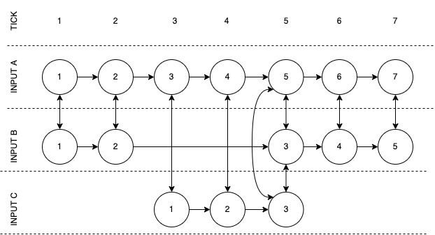

# Theory - Work in progress
This write up will refer to animals various cognitive capacities (as long as they are able to learn and adapt) as intelligent actors.

## Associations Storage
### Encoding binary input associations in a directed graph
Intelligent actors tend to do everything through relationships. These relationships are formed with all objects that intelligent actors interact with. These relationships, if they yield some utility, are built over time. Intelligent actor's relationships are complicated as they are formed from various data inputs such as video, audio, texture, smell, taste and internal chemical composition ("feeling"). All of these inputs are meshed together and encoded in a (on average) lossy format.
 
> It is wrong to assume that video input is just an image. How this video is encoded is critical as it needs to allow for discovery of light, texture, objects, space, shapes, etc. 

This inputs mesh is stored as a form of a directed graph. Continuous input stream (time) gives the graph direction, as time reveals fuzzy cause and effect.

(Figure 1)

For reasons not fully known, encodings are stored for different lengths of time (time to live). One of the reasons that certain encodings might be stored for a longer period of time is due to how different the data input is. That is if data input is very different to previous data inputs it is stored for longer. However this is a simplification as there are many factors at play such as relative context of the data input, how often association is used and how many other associations link to this association. See "Slime Mold" link for insparation. 

Intelligent actors associations are subjective as they are "unique" to the actor and do not necessarily represent the actual "objective" reality that they operate in.
 
It is not clear if associations graph when traversed passively (without inference search) by an intelligent actor provides experience of a memory. Or if there is also a deeper memory storage at play. The project's hypothesis is that the association graph itself acts like a memory. This would also explain why it is possible to change a memory or make memory "weaker" by recalling it too often. 

### Hub and emergence of ontology
Based on the associations section it is possible to assume that memories are stored in some directed graph clusters as seen in figure 1. However as more data is stored 1) these clusters will overlap and 2) there needs to be a way to route from cluster to cluster. This section brings a few concepts together by proposing a way of discovering where new inputs need to be recorded and how it can self organize for future inference and "memory recall".
 
As graphs are created, common overlaps will be created. These overlaps are connected, creating a hub. This hub becomes a concept or an abstract representation of a thing and it acts like a router between memory clusters. Hubs also connect to hubs (possibly after incubation period), once hub becomes overloaded (too many connections and routings) it splits giving way to more "clarity" on a concept.
 
Memory is either stored in a cluster and then it is connected to a relevant hub. Or hub is discovered and then stored in real-time. Either way it needs to be connected to the hub. Hub is created for different inputs horizontally (see figure 1), however it is also likely that it is created vertically.

### Emergent global, local and cross layer connectivity
This project's hypothesis is that the association graph will follow specific rules and as a result form a fractal graph. By selecting the most appropriate graph specification (through testing), fractal graph should emerge that will provide encoding of associations that will power further associations and inference.

Associations might be going through an incubation period, where local associations are created through trial and error. Only after a while they are then connected globally (consolidated) with the rest of the graph. Additionally it is possible to create different type of problem solving intelligent agents by going with different specific rules (as they will generate very different fractal graph).
 
> In the machine learning research community it has been noted that interesting "intelligent” unexpected behaviors occur when algorithms are scaled. Same is being said about fractal systems, 10 ants are not going to do anything sophisticated, however as more ants work together, interesting and unexpected properties emerge. **During implementation it should be remembered that quality can win over quality**.

## Inference
### Why infer at all?
The only reason for intelligent actor needing to infer is to get some kind of output. If output was not required then actor would simply observe and not do anything. That is not say that anything that reacts to the environment is an intelligent actor such as a Venus flytrap.

If (low capability) intelligent actors need reasoning only for the output (to interact with the environment) it would make sense for the fractal graph to be organised and optimised for output. 

### Artificial inference classes 
Intelligent actors infer through established association boundaries. Established inference types fall into the following classes: deduction, induction and abduction. It is believed that intelligent actors tend to use automatic induction (unconscious probabilistic generalization) and abduction (most likely available explanation at hand). These default modes of inference are limited due to intelligent actors' limited association boundaries.
 
Intelligent actors also use deduction (establishing logical conclusion based on logically true statements). Conscious deduction is the slowest type of inference as it requires an intelligent actor's active participation to build a "logical chain".
 
It is not clear if intelligent actors cognition actually handles these three methods of inference differently, it is probabilistically unlikely that this is the case as these are artificial concepts. It is more likely that intelligent actors' cognition uses one model for all reasoning; the only difference is actors' conscious participation.

### Faulty deduction
It is project's hypothesis that intelligent actors use deduction with faulty premises (**faulty deduction**). Faulty deduction is established by copying associations from neighbouring directed associations or by changing direction of the association. This faulty type of deduction auto-corrects and converges to an actual "relatively correct deduction" as intelligent actors probe their environment, gather more data and **update and expand** their associations. For this to work intelligent actors do not have to be **conscious**, it works as long as they can "sense" that they are getting closer towards reward part of the feedback loop. This feedback loop ineffect makes this system Turing complete.

## Links:
* (Slime Mould Algorithm)[https://en.wikiversity.org/wiki/Slime_Mould_Algorithm#:~:text=Slime%20mould%20algorithm%20(SMA)%20is,propagation%20wave%20of%20slime%20mould.]
* (How the Brainless Slime Mold Stores Memories)[https://www.smithsonianmag.com/smart-news/how-brainless-slime-mold-stores-memories-180977097/]
* (Spatial Neural Networks Based on Fractal Algorithms
Biomorph Nets of Nets)[http://www.fractal.org/Life-Science-Technology/Publications/Fractal-Neural-Networks.htm]
* (Is Deep Learning Innovation Just Due to Brute Force?)[https://medium.com/intuitionmachine/the-brute-force-method-of-deep-learning-innovation-58b497323ae5]
* (Emergence and Complexity)[https://www.youtube.com/watch?app=desktop&v=o_ZuWbX-CyE]
* (Your Mind Is Eight-Dimensional )[https://www.youtube.com/watch?app=desktop&v=akgU8nRNIp0&t=0s]
* (Donald Hoffman's Fitness-Beats-Truth Theorem Explained)[https://www.youtube.com/watch?app=desktop&v=kiO2vKx6pcI]
* (Why do we forget? New theory proposes 'forgetting' is actually a form of learning)[https://www.sciencedaily.com/releases/2022/01/220113111421.htm#:~:text=So%2C%20in%20effect%2C%20the%20scientists,access%20rather%20than%20memory%20loss]
 * (When the Brain Starts Adulting)[https://www.brainfacts.org/thinking-sensing-and-behaving/aging/2018/when-the-brain-starts-adulting-112018#:~:text=Your%20brain%20changes%20a%20lot,itself%20well%20into%20your%2020s.]
 
 

